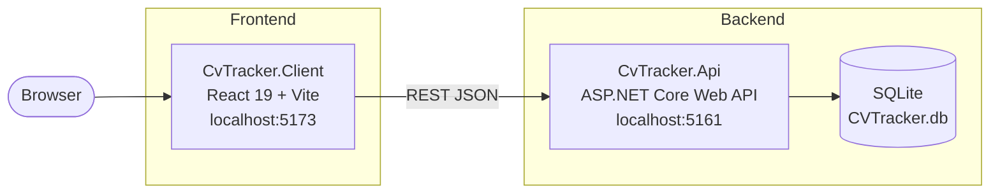

# Architecture

CV Tracker is a personal portfolio project — a Kanban-style job application tracker with local regex-based parsing of job offer text. The architecture is intentionally simple: a single ASP.NET Core Web API backed by SQLite, consumed by a React SPA.

## Runtime topology



## Project structure

```
CvTracker.Api/
├── Controllers/
│   ├── JobApplicationsController.cs   # GET/POST/PUT/PATCH/DELETE /api/jobapplications + notes
│   ├── ParseController.cs             # POST /api/parse — raw text → local regex → ScrapedOfferDto
│   ├── ProfileController.cs           # GET/PUT /api/profile, avatar, resume, skills
│   ├── TechnologiesController.cs      # GET /api/technologies — grouped technology list
│   └── Models/
│       ├── JobOffer.cs                # EF Core entity (Id, Position, SalaryMin, SalaryMax, enums, ...)
│       ├── JobOfferNote.cs            # EF Core entity — notes per offer (Id, JobOfferId, EventDate, Content)
│       ├── JobOfferTechnology.cs      # EF Core join entity — offer ↔ technology (composite PK)
│       ├── Technology.cs              # EF Core entity — canonical skill/technology (Id, Name, Category)
│       ├── TechnologyAlias.cs         # EF Core entity — raw text aliases for normalization
│       ├── UserProfile.cs             # EF Core entity — single-row user profile
│       ├── UserTechnology.cs          # EF Core entity — user skill with proficiency (1–5)
│       ├── ApplicationStatus.cs       # enum: Applied | Interview | Offer | Rejected | ...
│       ├── ContractType.cs            # enum: UoP | B2B | MandateContract | ...
│       ├── WorkLoad.cs                # enum: FullTime | PartTime
│       ├── WorkMode.cs                # enum: Remote | OnSite | Hybrid
│       └── DTOs/
│           ├── JobOfferDto.cs         # input DTO for create/update
│           ├── JobOfferNoteDto.cs     # input DTO for adding notes
│           ├── ParseTextRequest.cs    # input DTO for POST /api/parse
│           ├── ScrapedOfferDto.cs     # output from parse endpoint
│           ├── TechnologyCategoryDto.cs  # grouped technology response
│           ├── TechnologyDto.cs       # single technology item
│           ├── UpdateUserProfileRequest.cs
│           ├── UpdateUserTechnologiesRequest.cs
│           ├── UserProfileDto.cs
│           └── UserTechnologyDto.cs
├── Services/
│   ├── IJobOfferService.cs / JobOfferService.cs             # job offer CRUD + notes
│   ├── IOfferTextParserService.cs / OfferTextParserService.cs  # raw text → ScrapedOfferDto (local)
│   ├── SalaryParser.cs                                      # static — extracts PLN salary range
│   ├── ISkillNormalizationService.cs / SkillNormalizationService.cs  # raw text → Technology ID
│   ├── ISkillSeedingService.cs / SkillSeedingService.cs    # seeds Technologies from jobOfferSkills.json
│   └── Parsing/                       # focused sub-parsers used by OfferTextParserService
│       ├── ConditionsParser.cs        # extracts ContractType, WorkMode, WorkLoad
│       ├── OfferParserKeywords.cs     # keyword constants for section detection
│       ├── SectionParser.cs           # extracts Location and named sections
│       └── TitleCompanyParser.cs      # extracts Position and CompanyName
├── Data/AppDbContext.cs               # single DbContext; enum → string conversions, FK config
├── Migrations/                        # EF Core migrations (SQLite)
└── Program.cs                         # DI registration, CORS, Swagger, EF Core, startup seeding

CvTracker.Api.Tests/                   # xUnit + FluentAssertions + EF Core InMemory
├── Controllers/JobApplicationsControllerTests.cs
├── Services/
│   ├── JobOfferServiceTests.cs
│   ├── OfferTextParserServiceTests.cs
│   ├── SalaryParserTests.cs
│   ├── SkillNormalizationServiceTests.cs
│   └── SkillSeedingServiceTests.cs
└── Helpers/TestBuilders.cs

CvTracker.Client/
├── models/                            # TypeScript interfaces mirroring C# models
│   ├── ApplicationStatus.ts / ContractType.ts / WorkLoad.ts / WorkMode.ts
│   ├── Company.ts
│   ├── JobOffer.ts / JobOfferNote.ts
│   ├── Technology.ts                  # Technology + TechnologyCategory interfaces
│   ├── UserProfile.ts
│   └── UserSkill.ts                   # UserTechnology + request interfaces
└── src/
    ├── App.tsx                        # React Router v7 route tree (/, /dashboard, /profile)
    ├── components/                    # AddCompanyForm, ApplicationCard, Header, MatchScoreBadge,
    │                                  # Navbar, NotesTimeline, OfferDetailPanel, OfferDetailView,
    │                                  # OfferForm, OfferListItem, OfferListPanel, OfferSkillPicker,
    │                                  # ProfileInfoCard, SkillsCard, StatusColumn,
    │                                  # TechnologyPickerAccordion
    ├── pages/
    │   ├── Dashboard.tsx              # Kanban board — columns per ApplicationStatus
    │   ├── OffersPage.tsx             # full offer list + detail panel + add/edit form
    │   └── ProfilePage.tsx            # user profile editor with skills/technologies
    └── utils/offerUtils.ts
```

## Data model

Multiple entities share the database. All enum columns are stored as strings via `HasConversion<string>()`.

### `JobOffer` (main entity)

| Field | Type | Notes |
|---|---|---|
| `Id` | `int` | PK, auto-increment |
| `Position` | `string` | required |
| `ContractType` | `ContractType` | stored as string |
| `WorkLoad` | `WorkLoad` | stored as string |
| `WorkMode` | `WorkMode` | stored as string |
| `CompanyName` | `string?` | |
| `Location` | `string?` | |
| `SourceUrl` | `string?` | validated URL |
| `Status` | `ApplicationStatus` | stored as string |
| `SalaryMin` | `decimal?` | |
| `SalaryMax` | `decimal?` | |
| `AppliedAt` | `DateTimeOffset?` | |
| `FollowUpDate` | `DateTimeOffset?` | |
| `RecruiterName` | `string?` | |
| `RecruiterContact` | `string?` | |
| `SentCvVersion` | `string?` | |
| `RejectionReason` | `string?` | |
| `Notes` | `ICollection<JobOfferNote>` | cascade delete |
| `RequiredTechnologies` | `ICollection<JobOfferTechnology>` | cascade delete |
| `MatchScore` | `int?` | `[NotMapped]` — computed at query time |
| `RequiredSkillIds` | `List<int>` | `[NotMapped]` — hydrated from join |
| `RequiredSkillNames` | `List<string>` | `[NotMapped]` — hydrated from join |

### Other entities

| Entity | Key fields |
|---|---|
| `JobOfferNote` | `Id`, `JobOfferId`, `EventDate`, `Content` |
| `JobOfferTechnology` | `JobOfferId` + `TechnologyId` (composite PK) |
| `Technology` | `Id`, `Name` (unique), `Category` |
| `TechnologyAlias` | `Id`, `Alias` (unique), `TechnologyId` |
| `UserProfile` | `Id` (always 1), `FirstName`, `LastName`, `Location`, social URLs, `AvatarFileName`, `ResumeFileName` |
| `UserTechnology` | `Id`, `TechnologyId`, `Proficiency` (1–5) |

## Local text parsing pipeline

`POST /api/parse` accepts `{ "text": "..." }` (50–20 000 chars) and:

1. Validates the input length (≥ 50 chars, ≤ 20 000 chars).
2. Delegates to `IOfferTextParserService.Parse()` — **no external API calls**.
3. The service splits the text into lines and runs focused sub-parsers in parallel:
   - `TitleCompanyParser` → `Position`, `CompanyName`
   - `SalaryParser` → `SalaryMin`, `SalaryMax` (handles PLN ranges, "k" suffix, netto B2B ×1.23)
   - `SectionParser` → `Location`, `OurRequirements`, `WhatWeOffer`
   - `ConditionsParser` → `ContractType`, `WorkMode`, `WorkLoad`
4. `ISkillNormalizationService.FindAllInText()` scans the text for known aliases → `RequiredSkillIds`.
5. Returns the filled `ScrapedOfferDto` to the frontend, which pre-fills the offer form.

No API key is required for parsing.

## Key conventions

- **Service layer for job offers** — `JobApplicationsController` injects `IJobOfferService`; the service calls `AppDbContext` directly. `ProfileController` and `TechnologiesController` call `AppDbContext` directly (no service layer needed). No repository pattern.
- **Enums as strings** — every new enum property needs `.HasConversion<string>()` in `AppDbContext.OnModelCreating`.
- **No authentication** — single-user personal tool.
- **CORS** — `AllowReact` policy for `http://localhost:5173` only; configured in `Program.cs`.
- **JSON serialization** — `JsonStringEnumConverter` registered globally; enums travel as strings over the wire.
- **Skill seeding** — `Technologies` and `TechnologyAliases` are seeded once at startup from `CvTracker.Api/jobOfferSkills.json` by `ISkillSeedingService`. Seeding is idempotent and safe to re-run. The database is auto-migrated via `MigrateAsync()` in `Program.cs` on every startup — no manual `dotnet ef database update` required.
- **Skill system — ID only, no strings** — Skills and technologies are ALWAYS stored as `TechnologyId` integer foreign keys referencing the `Technologies` table. **It is strictly forbidden to store skill names as plain strings in any entity, DTO, or API payload.** `JobOffer.RequiredTechnologies` is `ICollection<JobOfferTechnology>`. `UserTechnology` holds a `TechnologyId` + `Proficiency`. The frontend works with `number[]` IDs. The only source of truth for skill names/categories is the `Technologies` table.
- **Local text parsing** — `POST /api/parse` uses only local regex/heuristics (via `IOfferTextParserService` and the `Services/Parsing/` sub-parsers). There is no external API dependency for parsing.
