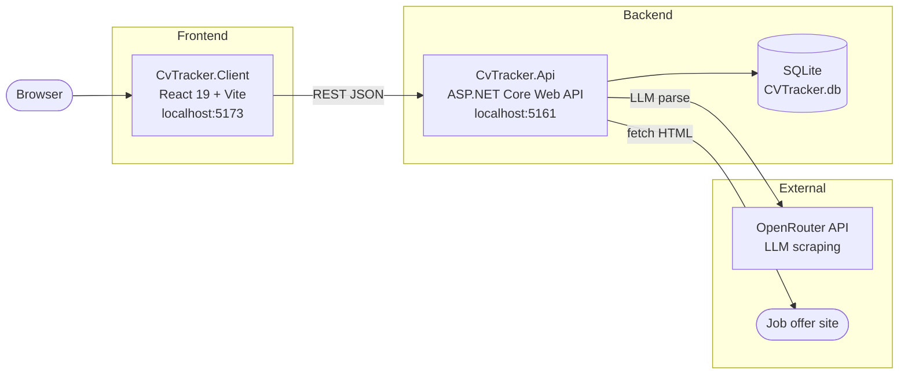

# Architecture

CV Tracker is a personal portfolio project — a Kanban-style job application tracker with AI-powered offer scraping. The architecture is intentionally simple: a single ASP.NET Core Web API backed by SQLite, consumed by a React SPA.

## Runtime topology



## Project structure

```
CvTracker.Api/
├── Controllers/
│   ├── JobApplicationsController.cs   # GET/POST/PUT/DELETE /api/jobapplications
│   ├── ScrapeController.cs            # POST /api/scrape — URL → HTML → LLM → JobOfferDto
│   └── Models/
│       ├── JobOffer.cs                # EF Core entity (Id, Position, Salary, enums, ...)
│       ├── ApplicationStatus.cs      # enum: Applied | Interview | Offer | Rejected | ...
│       ├── ContractType.cs           # enum: UoP | B2B | Zlecenie | ...
│       ├── WorkLoad.cs               # enum: FullTime | PartTime
│       ├── WorkMode.cs               # enum: Remote | OnSite | Hybrid
│       └── DTOs/
│           ├── JobOfferDto.cs        # input DTO for create/update
│           └── ScrapedOfferDto.cs    # output from LLM scraping
├── Data/AppDbContext.cs               # single DbContext; enum → string conversions
├── Migrations/                        # EF Core migrations (SQLite)
└── Program.cs                         # DI registration, CORS, Swagger, EF Core

CvTracker.Client/
├── models/                            # TypeScript interfaces mirroring C# models
│   ├── JobOffer.ts
│   ├── ApplicationStatus.ts
│   ├── ContractType.ts
│   ├── WorkLoad.ts
│   └── WorkMode.ts
└── src/
    ├── App.tsx                        # React Router v7 route tree
    ├── components/                    # ApplicationCard, JobOfferCard, StatusColumn, Header, ...
    └── pages/
        ├── HomePage.tsx               # Kanban board — columns per ApplicationStatus
        ├── Dashboard.tsx
        ├── OfferDetailPage.tsx
        └── AddEditOfferPage.tsx       # shared create/edit form with scrape-from-URL feature
```

## Data model

`JobOffer` is the only entity. All enum columns are stored as strings in SQLite via `HasConversion<string>()`.

| Field | Type | Notes |
|---|---|---|
| `Id` | `int` | PK, auto-increment |
| `Position` | `string` | required |
| `Salary` | `decimal` | |
| `ContractType` | `ContractType` | stored as string |
| `WorkLoad` | `WorkLoad` | stored as string |
| `WorkMode` | `WorkMode` | stored as string |
| `CompanyName` | `string?` | |
| `Location` | `string?` | |
| `Skills` | `string?` | free text |
| `OurRequirements` | `string?` | free text |
| `WhatWeOffer` | `string?` | free text |
| `Benefits` | `string?` | free text |
| `Status` | `ApplicationStatus` | stored as string |

## AI scraping pipeline

`POST /api/scrape` accepts `{ "url": "..." }` and:

1. Fetches the HTML of the job offer page via `ScrapeClient` (named `HttpClient` with browser-like headers).
2. Strips HTML tags, truncates to 12 000 chars.
3. Sends the text to OpenRouter with a structured JSON prompt asking the model to extract offer fields.
4. Parses the model response into `ScrapedOfferDto` and returns it to the frontend.
5. The frontend pre-fills `AddEditOfferPage` with the scraped data — the user reviews and saves.

Model and API key are configured via:
- `OpenRouter:Model` in `appsettings.json` (default: `mistralai/mistral-7b-instruct:free`)
- `OpenRouter:ApiKey` in **.NET user secrets only** — never in `appsettings*.json`

## Key conventions

- **No service/repository layer** — controllers call `AppDbContext` directly.
- **Enums as strings** — every new enum property needs `.HasConversion<string>()` in `AppDbContext.OnModelCreating`.
- **No authentication** — single-user personal tool.
- **CORS** — `AllowReact` policy for `http://localhost:5173` only; configured in `Program.cs`.
- **JSON serialization** — `JsonStringEnumConverter` registered globally; enums travel as strings over the wire.
